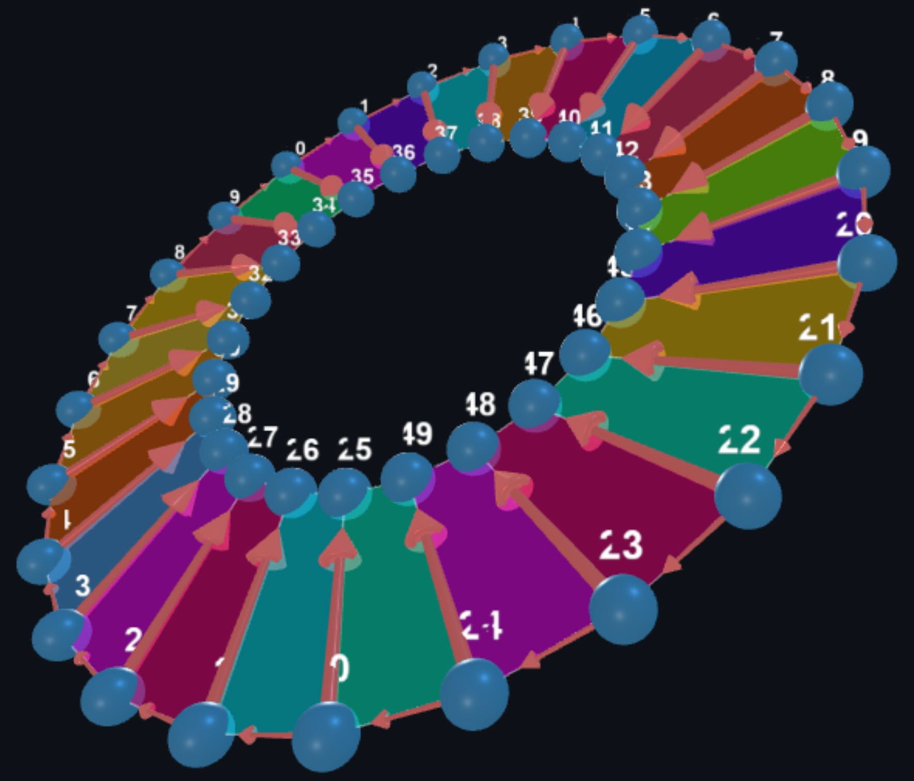

# 🌐 Zeid-Rosenberg Eigenvalue Explorer

[](https://opensource.org/licenses/MIT)
[](https://www.javascript.com/)
[](https://threejs.org/)
[](https://github.com/draazeid-git/graph-eigenvalue)

**A powerful web-based tool for visualizing graph structures, computing eigenvalues with exact arithmetic, and exploring spectral graph theory through an immersive 3D "Graph Universe" with eigenmode animation.**

🔗 **Live Demo:** [https://draazeid-git.github.io/graph-eigenvalue/](https://draazeid-git.github.io/graph-eigenvalue/)



---

## 📋 Table of Contents

- [Overview](#overview)
- [What's New in v35](#whats-new-in-v35)
- [Architecture](#architecture)
- [Key Features](#key-features)
- [Installation](#installation)
- [Quick Start Guide](#quick-start-guide)
- [Workspace Reference](#workspace-reference)
- [Mathematical Framework](#mathematical-framework)
- [API Reference](#api-reference)
- [File Structure](#file-structure)
- [Dependencies](#dependencies)
- [Version History](#version-history)
- [Contributing](#contributing)
- [Citation](#citation)
- [License](#license)

---

## Overview

The **Zeid-Rosenberg Eigenvalue Explorer** is a comprehensive web application for exploring the relationship between graph topology, matrix spectra, and dynamic behavior. It implements the **Zeid-Rosenberg eigenvalue estimation framework** with exact arithmetic computation via the **Souriau-Frame-Faddeev (SFF)** algorithm.

### What Makes This Tool Unique

| Feature | Description |
|---------|-------------|
| **Graph Universe** | Explore graph families as 3D "galaxies" positioned by spectral properties |
| **Exact Polynomial Computation** | BigInt arithmetic via SFF algorithm for precision |
| **Eigenmode Animation** | Click any eigenvalue to visualize its characteristic oscillation pattern |
| **Sparse Matrix Optimization** | SpMV enables dynamics for n > 100 on sparse graphs |
| **Spectral Gap Analysis** | Automatic expansion quality assessment with Cheeger bounds |
| **Analytic Detection** | 12+ pattern types for closed-form eigenvalue expressions |

---

## What's New in v35

### 🏗️ 7-Tab Interface

The UI is organized into 7 purpose-driven tabs:

```
┌──────────────────────────────────────────────────────────────────────────────────────────────────────────┐
│  🔨 BUILD  │  ✏️ EDIT  │  🧪 SIMULATE  │  📊 ANALYZE  │  📐 BOUNDS  │  🔧 ADVANCED   │  📚 LIBRARY   │
└──────────────────────────────────────────────────────────────────────────────────────────────────────── ─┘
```

| Tab | Purpose | Key Features |
|-----|---------|--------------|
| **BUILD** | Graph Construction | 61+ templates, layout options, force-directed, Universe integration |
| **EDIT**  | Manual Editing | Add/delete vertices & edges, drag mode, tool palette |
| **SIMULATE** | Dynamics & Animation | Integrators (Rodrigues, Cayley, Trapezoidal), eigenmode animation, phase diagrams |
| **ANALYZE** | Spectral Analysis | Graph info, SFF polynomial, clickable eigenvalues, eigenmode visualization |
| **BOUNDS** | Zeid-Rosenberg Bounds | α parameter, eigenvalue bounds estimation |
| **ADVANCED** | Graph Discovery | Analytic graph finder, search filters, graph products (□, ⊗, ⊕) |
| **LIBRARY** | Save & Export | Gallery view, JSON/HTML/LaTeX export, import |

### ⚡ SpMV Optimization for Large Graphs

New **Sparse Matrix-Vector Multiplication** enables smooth dynamics for large sparse graphs:

| Graph | n | Speedup |
|-------|---|---------|
| Path P₅₀₀ | 500 | **76x** |
| Cycle C₅₀₀ | 500 | **78x** |
| Star S₁₀₀₀ | 1000 | **~100x** |

### 📊 Spectral Gap Analysis

Comprehensive gap metrics with graph-theoretic interpretation:

```javascript
SpectralGapAnalyzer.analyze(eigenvalues, n, graphInfo)
// Returns: { adjacencyGap, normalizedGap, expansionQuality, interpretation }
```

### 🎯 Eigenmode Animation

Click any eigenvalue to visualize its characteristic oscillation pattern:

- **Cycles**: Traveling wave patterns
- **Paths**: Standing wave (sinusoidal) modes  
- **Stars**: Breathing modes (center vs leaves)
- **Complete**: Uniform and alternating patterns

### 🔢 Enhanced SFF Polynomial Engine

Exact characteristic polynomial via Souriau-Frame-Faddeev with BigInt:

```javascript
SpectralEngine.computeExactPolynomial(matrix)
// Returns exact integer coefficients: [1, 0, -2, 0] for P₃
```

---

## Architecture

### System Overview

```
┌─────────────────────────────────────────────────────────────────────────┐
│                         PRESENTATION LAYER                              │
├─────────────────────────────────────────────────────────────────────────┤
│  index.html             │  styles.css           │  7-Tab Interface      │
│  (main application)     │  (styling & themes)   │  (BUILD → LIBRARY)    │
└────────────┬────────────┴──────────┬────────────┴──────────┬────────────┘
             │                       │                       │
             ▼                       ▼                       ▼
┌─────────────────────────────────────────────────────────────────────────┐
│                         APPLICATION LAYER                               │
├─────────────────────────────────────────────────────────────────────────┤
│  main.js               │  matrix-analysis-ui.js  │  graph-universe.js   │
│  (orchestrator)        │  (eigenvalue UI)        │  (3D galaxy view)    │
└────────────┬───────────┴───────────┬─────────────┴──────────┬───────────┘
             │                       │                        │
             ▼                       ▼                        ▼
┌─────────────────────────────────────────────────────────────────────────┐
│                          COMPUTATION LAYER                              │
├─────────────────────────────────────────────────────────────────────────┤
│  spectral-analysis.js             │  dynamics-animation.js              │
│  ├─ SpectralEngine                │  ├─ SparseMatrix (CSR)              │
│  │   ├─ computeExactPolynomial    │  │   ├─ SpMV O(m)                   │
│  │   ├─ identifyClosedForm        │  │   └─ fromDense/fromEdges         │
│  │   └─ computeAnalyticEigenvector│  ├─ Eigenmode Animation             │
│  └─ SpectralGapAnalyzer           │  └─ Rodrigues/Cayley Integrators    │
├───────────────────────────────────┴─────────────────────────────────────┤
│  analytic-detection.js         │  zeid-rosenberg.js                     │
│  (graph family identification) │  (eigenvalue formulas)                 │
└─────────────────────────────────────────────────────────────────────────┘
             │                       │
             ▼                       ▼
┌─────────────────────────────────────────────────────────────────────────┐
│                           DATA LAYER                                    │
├─────────────────────────────────────────────────────────────────────────┤
│  graph-core.js         │  graph-library.js      │  graph-database.js    │
│  (Three.js scene,      │  (localStorage         │  (in-memory cache)    │
│   adjacency matrix)    │   persistence)         │                       │
└─────────────────────────────────────────────────────────────────────────┘
```

### Module Responsibilities

| Module | Size | Responsibility |
|--------|------|----------------|
| `main.js` | ~320KB | Application orchestrator, event binding, UI integration |
| `graph-core.js` | ~60KB | Three.js scene, vertex/edge rendering, force layout, face detection |
| `spectral-analysis.js` | ~75KB | **SpectralEngine**, **SpectralGapAnalyzer**, polynomial computation |
| `dynamics-animation.js` | ~55KB | **SparseMatrix**, **Eigenmode Animation**, integrators |
| `graph-universe.js` | ~135KB | 3D galaxy visualization, family clustering |
| `analytic-detection.js` | ~40KB | Graph family identification, pattern matching |
| `matrix-analysis-ui.js` | ~35KB | Eigenvalue display, clickable eigenmode triggers |

---

## Key Features

### 🔨 BUILD Tab - Graph Construction

- **61+ Built-in Templates** - Path, Cycle, Star, Complete, Wheel, Hypercube, Petersen, and more
- **Configurable Parameters** - Set vertices (n), dimensions, and family-specific options
- **Layout Options** - Circle, Sphere, Concentric arrangements
- **Force-Directed Layout** - Auto-arrange with physics simulation
- **Universe Integration** - Send graphs to 3D Galaxy view

### ✏️ EDIT Tab - Manual Graph Editing

- **Tool Palette** - Select, Add Vertex, Add Edge, Delete modes
- **Drag Mode** - Reposition vertices interactively
- **Edge Management** - Click to add/remove connections

### 🧪 SIMULATE Tab - Dynamics & Animation

- **Three Integrators**:
  - **Rodrigues** - Exact matrix exponential
  - **Cayley** - Symplectic rational approximation
  - **Trapezoidal** - Predictor-corrector scheme
- **SpMV Optimization** - O(m) instead of O(n²) for sparse graphs
- **Phase Diagrams** - xᵢ vs xⱼ, velocity, power plots

### 📊 ANALYZE Tab - Spectral Analysis

- **Graph Detection** - Automatic family identification (Cycle, Path, Star, etc.)
- **Eigenvalue Formulas** - Closed-form expressions (e.g., λₖ = 2cos(2kπ/n) ± 1)
- **Clickable Eigenvalues** - Click to trigger eigenmode animation
- **12+ Pattern Types** - Integer, fraction, √k, 2cos(kπ/m), golden ratio, nested radicals

### 📐 BOUNDS Tab - Zeid-Rosenberg Bounds

- **α Parameter Control** - Adjust eigenvalue estimation
- **Bound Visualization** - Compare theoretical bounds with actual spectrum

### 🔧 ADVANCED Tab - Discovery & Products

- **Analytic Graph Finder** - Search for graphs with closed-form eigenvalues
- **3D Graph Universe** - Galaxy visualization of graph families
- **Algebraic Operations**:
  - **G □ H** - Cartesian Product
  - **G ⊗ H** - Tensor Product  
  - **G ⊕ H** - Direct Sum
  - **L(G)** - Line Graph

### 📚 LIBRARY Tab - Save & Export

- **Table View** - Browse saved graphs with properties
- **Export Formats**: JSON, Standalone HTML, LaTeX
- **Import** - Load saved graph collections
- **Persistent Storage** - localStorage-based library

---

## Installation

### Option 1: Direct Download

```bash
# Download and extract
unzip graph-project-v35.zip
cd graph-project-v35

# Open in browser
open index.html
```

### Option 2: Local Development Server

```bash
# Using Python 3
python server.py
# Open http://localhost:8000

# Or using Node.js
npx serve .
# Open http://localhost:3000
```

### Option 3: GitHub Pages (Live Demo)

Visit: [https://draazeid-git.github.io/graph-eigenvalue/](https://draazeid-git.github.io/graph-eigenvalue/)

### System Requirements

| Requirement | Minimum |
|-------------|---------|
| Browser     | Chrome 80+, Firefox 75+, Safari 13+, Edge 80+ |
| WebGL       | Required for 3D rendering                     |
| Screen      | 1280×720 recommended                          |
| Memory      | 512MB for graphs up to n=500                  |

---

## Quick Start Guide

### 1. Building Graphs (BUILD)

```
1. Click "BUILD" tab
2. Set number of vertices
3. Select a template from dropdown (Path, Cycle, Star, etc.)
4. Click "Apply Template"
5. Use "▶ Start" force layout to auto-arrange
```

### 2. Editing Graphs (EDIT)

```
1. Click "EDIT" tab
2. Choose a tool: Select, Add Vertex, Add Edge, Delete
3. Click on canvas to add/remove elements
4. Drag vertices to reposition
5. Use "Clear All" to start fresh
```

### 3. Running Simulations (SIMULATE)

```
1. Click "SIMULATE" tab to simulate power flow between nodes
2. Select integrator (Rodrigues recommended)
3. Click "▶ Start" to begin dynamics
4. Adjust speed with slider
5. Enable phase diagram for trajectory analysis
```

### 4. Analyzing Eigenvalues (ANALYZE)

```
1. Click "ANALYZE" tab
2. View detected graph type and invariants
3. Examine eigenvalue formulas (e.g., λₖ = 2cos(2kπ/n) ± 1)
4. Click any eigenvalue to animate its eigenmode
5. Watch vertices oscillate according to eigenvector pattern
```

### 5. Exploring Bounds (BOUNDS)

```
1. Click "BOUNDS" tab
2. Adjust α parameter
3. View Zeid-Rosenberg eigenvalue bounds
4. Compare bounds with actual eigenvalues
```

### 6. Advanced Features (ADVANCED)

```
1. Click "ADVANCED" tab
2. Use "Find Analytic Graphs" to search for graphs with closed-form eigenvalues
3. Apply graph products: G □ H (Cartesian), G ⊗ H (Tensor), G ⊕ H (Direct Sum)
4. Explore the 3D Graph Universe
```

### 7. Saving & Exporting (LIBRARY)

```
1. Click "LIBRARY" tab
2. Enter graph name, click "💾 Save to Library"
3. Browse saved graphs in table view
4. Export as JSON, HTML, or LaTeX
5. Import previously saved graphs
```

---

## Tab Reference

### Mouse Controls

| Control       | Action |
|---------------|--------|
| Left-drag     | Rotate view |
| Right-drag    | Pan view    |
| Scroll        | Zoom in/out |
| Click vertex  | Select (behavior depends on current tool) |
| Double-click  | Load graph (in Universe view) |

### Keyboard Shortcuts

| Key | Action |
|-----|--------|
| `Space` | Toggle dynamics simulation |
| `R`     | Reset dynamics |
| `F`     | Fit graph to view |
| `Esc`   | Deselect / Cancel |
| `?`     | Show keyboard shortcuts help |

---

## Mathematical Framework

### Souriau-Frame-Faddeev Algorithm

The SFF algorithm computes the exact characteristic polynomial using Newton's identities:

```
P(λ) = det(λI - A)

Coefficients computed via:
  c_k = -1/k × Σⱼ₌₁ᵏ cₖ₋ⱼ × trace(Aʲ)
```

**Implementation** uses BigInt arithmetic for matrices with entries in {-1, 0, 1}:

```javascript
SpectralEngine.computeExactPolynomial(matrix)
// P₃ path: [1n, 0n, -2n, 0n] → λ³ - 2λ
// C₄ cycle: [1n, 0n, -4n, 0n, 0n] → λ⁴ - 4λ²
// K₃ complete: [1n, 0n, -3n, -2n] → λ³ - 3λ - 2
```

### Eigenvalue Pattern Detection

The SpectralEngine identifies 12+ closed-form patterns:

| Pattern Type     | Example   | Formula                |
|------------------|-----------|------------------------|
| Integer          | 3, -2, 0  | exact match            |
| Fraction         | 3/2, -1/4 | p/q with q ≤ 12        |
| Simple Radical   | √2, √7    | √k for k ≤ 100         |
| Compound Radical | (1+√5)/2  | (a±√b)/c               |
| Nested Radical   | √(2+√2)   | √(a±√b)                |
| Trigonometric    | 2cos(π/5) | 2cos(kπ/m), 2sin(kπ/m) |
| Wheel Type       | 1+√7      | 1 + 2cos(kπ/m)         |
| Golden Ratio     | φ, ψ      | (1±√5)/2               |

### Spectral Gap Formulas

| Graph Family | Gap Formula    | Expansion |
|--------------|----------------|-----------|
| Complete Kₙ  | n              | Excellent |
| Hypercube Qₐ | 2 (constant)   | Excellent |
| Petersen     | 2              | Excellent |
| Star Sₙ      | √(n-1)         | Good     |
| Cycle Cₙ     | 4sin²(π/n) → 0 | Poor |
| Path Pₙ      | O(1/n²) → 0    | Poor |

### Eigenmode Animation

The eigenmode animation visualizes how graph vertices oscillate according to a specific eigenvector pattern. Here is the complete mathematical framework:

#### The Fundamental Equation

For a graph with adjacency matrix **A**, the dynamics follow:

```
ẋ = Ax
```

where **x**(t) is the state vector (one value per node).

#### Eigenvalue Decomposition

If **v** is an eigenvector of **A** with eigenvalue λ:

```
Av = λv
```

Then the solution starting from **x**(0) = **v** is:

```
x(t) = e^{λt} · v
```

#### Two Cases: Symmetric vs Skew-Symmetric

| Matrix Type | Eigenvalues | Solution | Behavior |
|-------------|-------------|----------|----------|
| Symmetric (undirected) | Real: λ ∈ ℝ | x(t) = cos(λt)·v | Standing wave |
| Skew-symmetric (directed) | Imaginary: λ = iω | x(t) = cos(ωt)·v_real - sin(ωt)·v_imag | Traveling wave |

#### What Each Component Means

For node *i* with eigenvector component vᵢ:

| Property | Determined By | Formula |
|----------|---------------|---------|
| **Amplitude** | \|vᵢ\| | Max displacement ∝ \|vᵢ\| |
| **Phase** | arg(vᵢ) | When node reaches maximum |
| **Frequency** | \|λ\| | ω = \|λ\| rad/time |
| **Period** | 2π/\|λ\| | T = 2π/ω |

#### Computing xᵢ(t) — The Scalar State

**Step 1: Normalize the Eigenvector**

Find maximum amplitude across all nodes:
```
A_max = max_i √((v_i^real)² + (v_i^imag)²)
scale = 1 / A_max
```

**Step 2: Time Evolution**

At each frame with phase φ = ω·t:
```
xᵢ(t) = scale × [cos(φ) × vᵢ^real - sin(φ) × vᵢ^imag]
```

Result: xᵢ(t) ∈ [-1, +1] (normalized range)

#### Computing r̂ᵢ — The Direction Vector

**Step 1: Compute Graph Centroid**
```
c = (1/n) × Σⱼ pⱼ⁽⁰⁾
```

**Step 2: Vector from Centroid to Node**
```
dᵢ = pᵢ⁽⁰⁾ - c
```

**Step 3: Normalize to Unit Vector**
```
r̂ᵢ = dᵢ / |dᵢ|
```

Special case: If node is at centroid (|dᵢ| < 0.01), use r̂ᵢ = (0, 1, 0)

#### Displacement Scale

The displacement amplitude scales with graph size:
```
dispScale = 0.3 × L̄
```
where L̄ is the average edge length.

#### Final Position Formula

The animated position of node *i* at time *t*:

```
┌─────────────────────────────────────────────────────────────┐
│  pᵢ(t) = pᵢ⁽⁰⁾ + xᵢ(t) × dispScale × r̂ᵢ                     │
│           ↑        ↑         ↑          ↑                   │
│        original  state    world     direction               │
│        position  [-1,1]   units     (unit vec)              │
└─────────────────────────────────────────────────────────────┘
```

#### Summary Table

| Quantity | Formula | Range/Units |
|----------|---------|-------------|
| xᵢ(t) | scale × [cos(ωt)·vᵢ^real - sin(ωt)·vᵢ^imag] | [-1, +1] |
| r̂ᵢ | (pᵢ⁽⁰⁾ - c) / \|pᵢ⁽⁰⁾ - c\| | unit vector |
| dispScale | 0.3 × (average edge length) | world units |
| ω | max(\|λ\|, 0.5) | rad/frame |

#### Visual Interpretation

| Condition | Behavior | Color |
|-----------|----------|-------|
| xᵢ(t) > 0 | Node moves outward from centroid | Orange/Red |
| xᵢ(t) < 0 | Node moves inward toward centroid | Blue |
| xᵢ(t) ≈ 0 | Node stays near original position | White |

#### Physical Interpretation by Eigenvalue

| Eigenvalue | Behavior | Analogy |
|------------|----------|---------|
| λ > 0 (large) | High frequency | Stiff spring mode |
| λ ≈ 0 | Low frequency | Soft/floppy mode |
| λ = iω (skew) | Rotation/wave | Energy circulation |

#### Example: Cycle Graph Cₙ

For cycle Cₙ, eigenvalue λₖ = 2cos(2πk/n) has eigenvector:
```
vⱼ = exp(2πijk/n) = cos(2πjk/n) + i·sin(2πjk/n)
```

| Mode k | Pattern | Description |
|--------|---------|-------------|
| k = 0 | All nodes together | Breathing mode |
| k = 1 | One wave around cycle | Fundamental mode |
| k = 2 | Two waves around cycle | Second harmonic |
| k = n/2 | Alternating nodes | Highest frequency |

**Analytic eigenvectors for known families:**

| Graph | Mode k | Eigenvector |
|-------|--------|-------------|
| Cycle Cₙ | k | v[j] = exp(2πijk/n)/√n |
| Path Pₙ | k | v[j] = sin(πjk/(n+1)) |
| Star Sₙ | 0,n-1 | v = [±√(n-1), 1, 1, ...]/norm |

---

## API Reference

### SpectralEngine (`spectral-analysis.js`)

```javascript
// Exact characteristic polynomial (BigInt)
SpectralEngine.computeExactPolynomial(matrix)
// Returns: BigInt[] coefficients [cₙ, cₙ₋₁, ..., c₀]

// Identify closed-form for numerical value
SpectralEngine.identifyClosedForm(value, n, tolerance)
// Returns: { type, formula, isExact, ... }

// Analyze full spectrum
SpectralEngine.analyzeSpectrum(eigenvalues, n, tolerance)
// Returns: { allAnalytic, eigenvalues: [{value, multiplicity, form, isExact}] }

// Compute eigenvector (analytical for known families)
SpectralEngine.computeAnalyticEigenvector(graphType, n, k, forSkew)
// Returns: { real: [], imag: [], eigenvalue, formula }

// Numerical eigenvector via inverse iteration
SpectralEngine.computeEigenvector(A, eigenvalue, isSkew, maxIter)
// Returns: { real: [], imag: [], converged }
```

### SpectralGapAnalyzer (`spectral-analysis.js`)

```javascript
// Comprehensive gap analysis
SpectralGapAnalyzer.analyze(eigenvalues, n, graphInfo)
// Returns: {
//   adjacencyGap, absoluteGap, normalizedGap, spectralWidth,
//   λ1, λ2, λn,
//   gapFormula, gapIsAnalytic,
//   expansionQuality: { quality, rating, description },
//   interpretation
// }

// Known formulas for graph families
SpectralGapAnalyzer.getKnownFormula({ type, n })
// Returns: { formula, value, note }

// Classify expansion quality
SpectralGapAnalyzer.classifyExpansion(normalizedGap)
// Returns: { quality: 'Excellent'|'Good'|'Moderate'|'Weak'|'Poor', rating: 1-5 }
```

### SparseMatrix (`dynamics-animation.js`)

```javascript
// Create sparse matrix (CSR format)
const sparse = new SparseMatrix(n);
sparse.fromDense(adjacencyMatrix);  // or
sparse.fromEdges(edges, symmetric);

// Sparse Matrix-Vector Multiplication: O(m) vs O(n²)
sparse.multiply(x, y);  // y = A*x

// Compute derivative in-place
sparse.computeDerivative(x, dxdt);  // dxdt = A*x

// Check if sparse representation is beneficial
sparse.isSparse();  // true if density < 10%

// Get statistics
sparse.getStats();  // { n, nnz, density, maxDegree, avgDegree, memoryRatio }
```

### Eigenmode Animation (`dynamics-animation.js`)

```javascript
// Start eigenmode animation
startEigenmodeAnimation({
  eigenvalue: { real, imag },
  eigenvector: { real: [], imag: [] },
  formula: '2cos(π/5)',
  modeIndex: k
});

// Stop animation
stopEigenmodeAnimation();

// Check state
isEigenmodeActive();  // boolean
getEigenmodeData();   // current eigenmode object
```

### Workspace Controller (`workspace-controller.js`)

```javascript
// Switch workspace
switchWorkspace('lab' | 'studio' | 'spectrum' | 'dynamics' | 'archives');

// Get current workspace
getCurrentWorkspace();  // string

// Update UI elements
updateNavGraphInfo({ name, n, m, isAnalytic, analyticType });
updateQuickStats({ n, m, type, rho });
updateInvariants({ n, m, rho, gap });
updateDetectionBadge({ name, confidence });
updateEigenvalueTable(eigenvalues, containerId);
```

---

## File Structure

```
graph-project-v35/
├── index.html              # Main application (7-tab UI)
├── styles.css              # Main stylesheet
│
├── main.js                 # Application orchestrator (317KB)
│
├── graph-core.js           # Three.js scene, vertex/edge rendering (60KB)
│                           #   - Face detection for polyhedra
│                           #   - Force-directed layout
│
├── graph-universe.js       # 3D galaxy visualization (133KB)
│
├── spectral-analysis.js    # SpectralEngine, SpectralGapAnalyzer (75KB)
│                           #   - SFF exact polynomial (BigInt)
│                           #   - 12+ pattern detection
│                           #   - Analytic eigenvector computation
│
├── dynamics-animation.js   # Simulation engine (55KB)
│                           #   - SparseMatrix (CSR format)
│                           #   - SpMV optimization
│                           #   - Eigenmode animation
│                           #   - Rodrigues/Cayley/Trapezoidal integrators
│
├── matrix-analysis-ui.js   # Eigenvalue display UI (35KB)
├── analytic-detection.js   # Graph family identification (40KB)
├── zeid-rosenberg.js       # Eigenvalue formulas (25KB)
│
├── graph-library.js        # localStorage persistence (15KB)
├── graph-database.js       # In-memory caching (20KB)
├── graph-finder.js         # Graph search utilities (10KB)
│
├── server.py               # Local development server
├── eigenvalue-verify.html  # Standalone verification tool
│
├── DEPENDENCIES.md         # External library documentation
├── LICENSE                 # MIT License
└── docs/
    └── images/
        └── demo-wheel-graph.gif
```

---

## Dependencies

### External Libraries

| Library | Version | CDN | Purpose |
|---------|---------|-----|---------|
| Three.js | r160+ | unpkg.com | 3D WebGL rendering |
| OrbitControls | (bundled) | unpkg.com | Camera interaction |

**No other external dependencies** - pure vanilla JavaScript ES6+

### Browser APIs Used

| API                   | Purpose                     |
|-----------------------|-----------------------------|
| WebGL 2.0             | 3D graphics rendering       |
| BigInt                | Exact polynomial arithmetic |
| localStorage          | Persistent graph library    |
| FileReader            | Import/export files         |
| ResizeObserver        | Responsive layout           |
| requestAnimationFrame | Smooth animation            |

### Import Map

```html
<script type="importmap">
{
    "imports": {
        "three": "https://unpkg.com/three@0.160.0/build/three.module.js",
        "three/addons/": "https://unpkg.com/three@0.160.0/examples/jsm/"
    }
}
</script>
```

---

## Version History

### v35 (Current) - Major Performance & Visualization Update

**New Features:**
- ✨ **7-Tab Interface** - BUILD, EDIT, SIMULATE, ANALYZE, BOUNDS, ADVANCED, LIBRARY
- ⚡ **SpMV Optimization** - 76-100x speedup for sparse graph dynamics
- 🎯 **Eigenmode Animation** - Click eigenvalue to visualize oscillation pattern with vertex displacement
- 🔢 **Enhanced SFF Engine** - BigInt exact polynomial computation
- 🎨 **Polyhedron Face Detection** - Automatic face rendering with minimal cycle detection
- 📊 **Closed-Form Eigenvalue Display** - Formulas like λₖ = 2cos(2kπ/n) ± 1

**Technical Improvements:**
- SparseMatrix class with CSR format
- Graph-aware denominators for pattern detection
- Analytical eigenvector computation for cycles, paths, stars, complete graphs
- Minimal cycle detection (triangles through octagons)
- Improved tolerance handling (1e-9 default)

### v34
- Enhanced analytic detection with 20+ graph families
- Improved eigenvalue formula display
- Template preview canvas

### v33
- Consistent axis scaling in Universe view
- Global normalization across families
- Comprehensive README documentation

### v32
- Family-based clustering for test graphs
- Improved custom graph positioning

### v31
- Deterministic positioning (removed random jitter)
- Hash-based offsets for overlap prevention

### v30
- Test graph generation (Star, Path, Cycle, Complete, Wheel, Petersen, Hypercube)
- Debug logging for verification

---

## Contributing

Contributions are welcome! Please:

1. Fork the repository
2. Create a feature branch (`git checkout -b feature/amazing-feature`)
3. Commit changes (`git commit -m 'Add amazing feature'`)
4. Push to branch (`git push origin feature/amazing-feature`)
5. Open a Pull Request

### Code Style

- ES6+ JavaScript with modules
- JSDoc comments for public functions
- Console logging for debugging
- Update README for new features

### Testing

```bash
# Run test scripts
node test-graph-families.js

# Verify in browser console
SpectralEngine.computeExactPolynomial([[0,1,0],[1,0,1],[0,1,0]])
// Should return [1n, 0n, -2n, 0n] for P₃
```

---

## Citation

If you use this tool in academic work, please cite:

```bibtex
@software{zeid2025grapheigenvalue,
  author = {Zeid, Ashraf},
  title = {Zeid-Rosenberg Eigenvalue Explorer},
  year = {2025},
  version = {35},
  url = {https://github.com/draazeid-git/graph-eigenvalue},
  note = {Interactive tool for spectral graph theory visualization with exact arithmetic}
}
```

### Related Work

- Zeid, A. & Rosenberg, J. (2025). "Analytic Eigenvalue Formulas for Structured Graphs."
- Souriau, J.-M. (1948). "Une méthode pour la décomposition spectrale."
- Faddeev, D.K. & Faddeeva, V.N. (1963). "Computational Methods of Linear Algebra."

---

## License

This project is licensed under the MIT License - see the [LICENSE](LICENSE) file for details.

```
MIT License
Copyright (c) 2025 Ashraf Zeid
```

---

## Author

**Dr. Ashraf Zeid**

- GitHub: [@draazeid-git](https://github.com/draazeid-git)
- Project: [https://github.com/draazeid-git/graph-eigenvalue](https://github.com/draazeid-git/graph-eigenvalue)

---

## Acknowledgments

- **Three.js** team for excellent 3D rendering
- **Souriau, Frame, and Faddeev** for the elegant polynomial algorithm
- Graph theory community for foundational mathematics
- Contributors and testers who helped improve this tool

---

<p align="center">
  <i>Built with ❤️ for the mathematical visualization community</i>
</p>

<p align="center">
  <a href="#-zeid-rosenberg-eigenvalue-explorer">Back to Top ⬆️</a>
</p>
